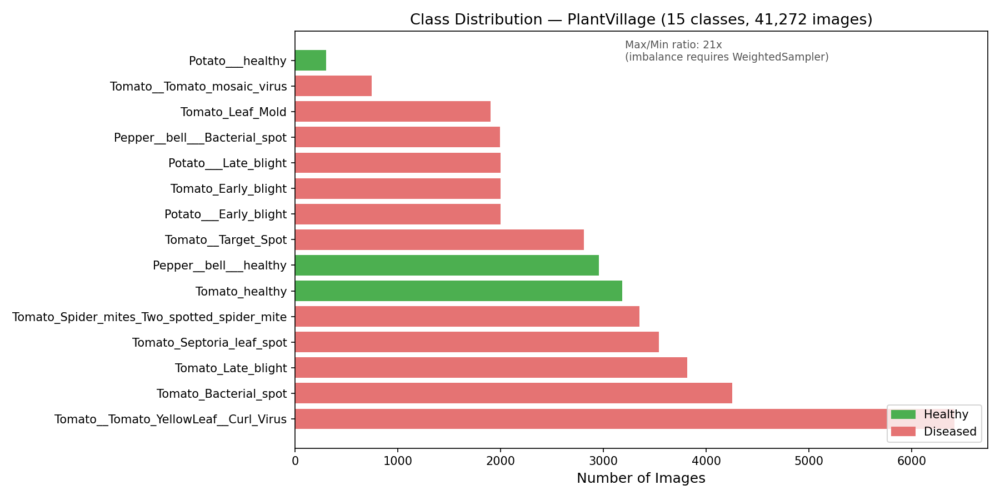
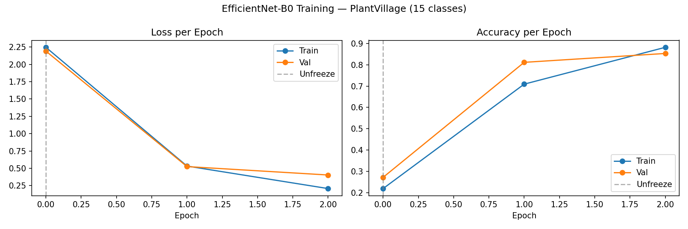
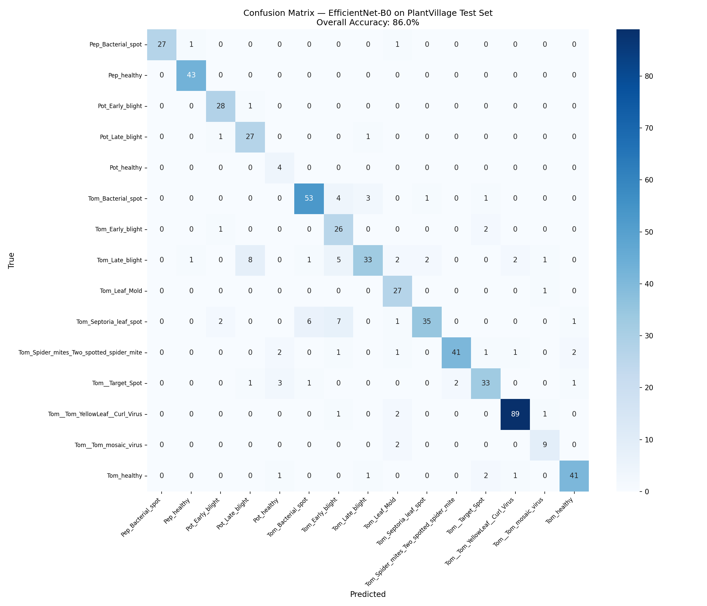
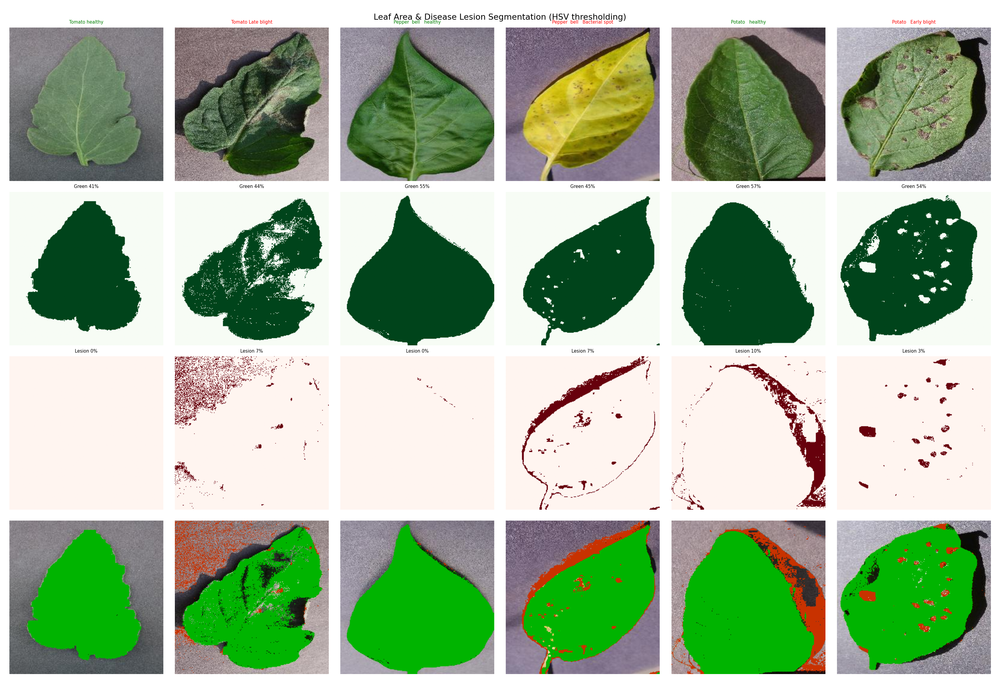
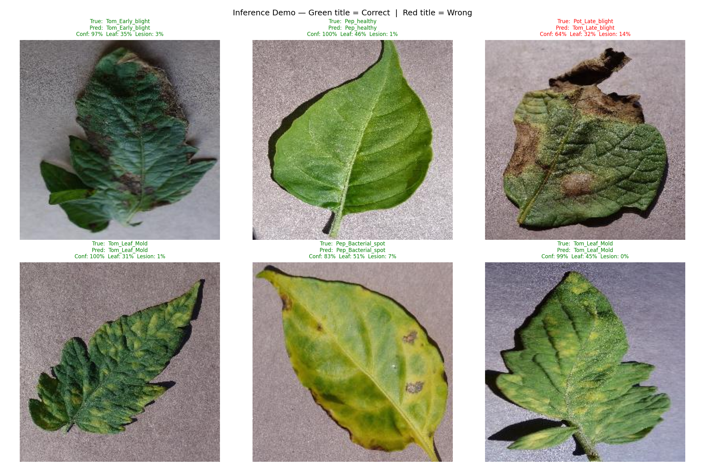

# Plant Disease Vision Challenge

This project started from a simple challenge: can a computer look at a leaf image and say something useful about plant health?

The brief in [docs/Challenge.md](docs/Challenge.md) asked for a solution that could detect and quantify plant characteristics, especially leaf area and disease symptoms. Instead of trying to solve everything at once, this repository takes a practical path:

- First, learn to classify the disease or healthy condition from the image.
- Then, complement that prediction with a lightweight segmentation step that estimates healthy leaf area and diseased lesion area.

The result is a compact computer vision pipeline for the PlantVillage dataset that combines deep learning classification with classical image processing.

## The Story

The dataset looks friendly at first glance: clean backgrounds, labeled folders, thousands of images. But the real challenge appears when we inspect the class distribution.

- The dataset contains 15 classes from tomato, potato, and bell pepper leaves.
- It includes 20,638 images in total.
- The largest class is about 21 times bigger than the smallest one.



This plot makes the imbalance visible. A few classes dominate the dataset, while others appear only rarely. That is why the training pipeline uses weighted sampling and class-weighted loss instead of relying on raw accuracy alone.

That imbalance matters. A model can look accurate overall while still doing a poor job on rare diseases. Because of that, the project was designed around two goals:

1. Learn a strong visual representation with transfer learning.
2. Reduce imbalance bias with weighted sampling and class-weighted loss.

## What Was Built

### 1. Disease Classification

An EfficientNet-B0 model was fine-tuned on PlantVillage using PyTorch and `timm`.

- Transfer learning from ImageNet
- Stratified train/validation/test split
- `WeightedRandomSampler` for class imbalance
- Class-weighted cross-entropy loss
- Two-stage training: frozen backbone first, then full fine-tuning

During the quick-run experiment documented in the notebooks:

- Train split: 2,800 images
- Validation split: 600 images
- Test split: 600 images
- Best validation accuracy: `0.8533`

### 2. Leaf Area and Lesion Segmentation

To address the challenge requirement beyond classification, notebook 4 adds an HSV-based segmentation step:

- Green pixels approximate healthy leaf area
- Brown/yellow pixels approximate lesion area

This is intentionally simple. It works well on PlantVillage because the images are captured under controlled conditions, and it gives an interpretable estimate of visible damage without requiring a full pixel-level annotated segmentation dataset.

### 3. Combined Inference

The final demo function, `predict_and_segment()`, returns:

- top-1 predicted class
- confidence score
- top-3 predictions
- estimated healthy leaf area percentage
- estimated lesion area percentage

So the output is not just "what disease is this?" but also "how much of the visible leaf seems affected?"

## Why This Approach Makes Sense

The challenge looks simple when written in one sentence, but the image actually contains several layers of information. A healthy leaf is not defined only by its species. Disease appears through color shifts, texture changes, spots, mold patterns, necrotic regions, and the relative proportion of damaged tissue. That is why the project uses a hybrid pipeline instead of a single rule.

### From Pixels to Symptoms

A convolutional neural network is useful here because it learns visual patterns hierarchically:

- early layers detect edges, color gradients, and fine textures
- middle layers capture spots, veins, and lesion shapes
- deeper layers combine those clues into class-level disease signatures

This fits plant pathology well, because the difference between two classes may begin as a small color or texture cue and end as a recognizable disease pattern.

### Why Transfer Learning

Training a vision model from scratch would ask too much from a relatively modest labeled dataset. Transfer learning is the practical answer. The model begins with ImageNet-trained visual features and then adapts them to plant images.

The intuition is simple:

- general features like edges and textures transfer well across image domains
- fine-tuning converges faster than training from zero
- pretraining reduces the amount of data needed to reach useful performance

That is also why the training is split into two phases:

- first, train the classification head while the backbone stays frozen
- then, unfreeze the full network and fine-tune with a smaller learning rate

This stabilizes training early and avoids damaging the pretrained representation too aggressively.

### Why EfficientNet-B0

EfficientNet-B0 was chosen because it offers a strong tradeoff between model capacity and practicality.

- it is compact enough to train comfortably in this project setup
- it still captures rich visual detail
- it is a strong transfer-learning baseline for 224x224 natural images

In storytelling terms, it is the right kind of tool for this stage of the project: strong enough to be credible, light enough to stay practical.

There is also a useful architectural idea behind EfficientNet. Instead of scaling only one thing, such as depth or width, EfficientNet scales three dimensions together:

- depth: how many layers the network has
- width: how many channels each layer uses
- resolution: how much visual detail enters the model

That balance matters because leaf disease cues live at different scales. Some are global color shifts, while others are local spots or edge irregularities. EfficientNet is designed to preserve that balance efficiently.

It also uses Squeeze-and-Excitation blocks, which act like channel-wise attention. In plain terms, the network learns which feature maps matter most and boosts them. For plant images, that can help amplify disease-relevant color and texture channels while suppressing less useful background information.

### Why Class Imbalance Needed Special Treatment

The biggest trap in this dataset is imbalance. Some classes appear often enough that a model can learn them easily, while rare classes can be drowned out during training. If we only optimized for overall accuracy, the model could look better than it really is.

Two mechanisms were used together:

- `WeightedRandomSampler` makes minority classes appear more often during training
- class-weighted cross-entropy increases the penalty for mistakes on underrepresented classes

This combination matters because it shifts learning pressure toward the rare classes instead of letting the majority classes dominate every epoch.

The idea can be written simply. If a class appears less often, it receives a larger weight:

```text
sample weight ~ 1 / class count
```

So a rare class contributes more often during sampling and more strongly during loss computation. That does not magically solve imbalance, but it does stop the model from learning the easy majority classes first and forgetting the rest.

### Why Data Augmentation and Normalization Matter

Even though PlantVillage images are controlled, the model still benefits from seeing small variations during training.

- random flips help because leaves do not have a fixed orientation
- small rotations make the model less sensitive to pose
- color jitter helps simulate moderate lighting variation

Normalization was also computed from the dataset itself so the model sees a more consistent input distribution. None of these steps are flashy, but together they improve stability and generalization.

Another useful detail is that augmentation is label-preserving. Rotating or flipping a leaf does not change its disease label, so those transformations increase diversity without changing the meaning of the image. This is a practical way to make a modest dataset behave like a slightly larger one.

The same logic applies to normalization. Pixel values are centered and scaled channel by channel so that the network receives more stable inputs:

```text
normalized pixel = (pixel - mean) / std
```

That makes optimization smoother and helps the pretrained backbone adapt to the new dataset.

### Why AdamW and Cosine Scheduling

Optimization is part of the theory too. This project uses AdamW because it combines adaptive learning rates with explicit weight decay, which tends to generalize better than plain Adam in many vision tasks.

The learning rate is then reduced with cosine annealing. Instead of dropping in a sudden step, it decreases smoothly over time. Conceptually, that means:

- early training can move quickly
- later training makes smaller corrections
- fine-tuning becomes less destructive to pretrained features

This pairs naturally with the two-phase training strategy.

### Why HSV Segmentation Was Added

Classification answers "what is this?" but the challenge also asks for quantification. That is where the second branch comes in.

Instead of training a full segmentation network without pixel-level annotations, the project uses HSV color thresholding:

- green ranges estimate healthy leaf tissue
- yellow/brown ranges estimate diseased lesion regions

This choice is not the most sophisticated possible, but it is aligned with the data. PlantVillage images have controlled backgrounds and lighting, which makes a color-space method surprisingly effective as a first quantification baseline.

This is also a good place to explain why HSV is preferred over RGB. In RGB, color and brightness are entangled. In HSV, they are separated into:

- hue: the actual color family
- saturation: how pure or vivid the color is
- value: brightness

That makes thresholding more intuitive. Healthy tissue usually stays in the green hue range, while lesions drift toward yellow, brown, or reddish tones. Because hue is separated from brightness, the segmentation is easier to reason about than a direct RGB rule.

In simplified form, the two coverage measures are:

```text
green coverage   = green-mask pixels   / total image pixels
disease coverage = lesion-mask pixels  / total image pixels
```

These are not clinical measurements, but they are useful interpretable proxies.

### How the Two Parts Work Together

The project can be read as a small decision pipeline:

```text
Input leaf image
    |
    +--> EfficientNet-B0 classifier
    |      -> top-1 prediction
    |      -> top-3 classes
    |      -> confidence scores
    |
    +--> HSV segmentation
           -> healthy leaf coverage
           -> lesion coverage
```

That is the key theoretical idea behind the repository: classification and quantification are related, but they do not need to be solved by exactly the same mechanism.

The broader architecture can also be read like this:

```text
Leaf image
    -> augmentation and normalization
    -> EfficientNet-B0 backbone
    -> classification head
    -> softmax probabilities

Leaf image
    -> HSV conversion
    -> green and lesion masks
    -> coverage percentages
```

One branch learns from data. The other encodes explicit color rules. Together they provide a more educational and interpretable solution than either branch alone.

### How Success Was Measured

Because the classes are imbalanced, accuracy alone would hide important failures. The evaluation therefore emphasizes:

- precision and recall at the class level
- F1-score as the balance between the two
- macro F1 because it gives each class equal importance
- confusion matrices to reveal which diseases look similar to the model

For segmentation, the project uses visual inspection and coverage percentages rather than IoU-style metrics, because the dataset does not provide pixel-level ground-truth masks.

It helps to read the classification metrics this way:

- precision asks: when the model predicts a class, how often is it correct?
- recall asks: when that class is truly present, how often does the model find it?
- F1-score balances the two, so a model cannot look good by optimizing only one side

Macro F1 is especially important here because it treats each class equally, even when one class has far fewer examples than another. In an imbalanced dataset, that makes it more informative than accuracy alone.

## Results

The most important outcome is that the model does more than memorize the dominant classes.

On the held-out test set from the current quick-run configuration saved in the notebooks:

- Test accuracy: `86.0%`
- Macro F1: `0.8341`
- Weighted F1: `0.8606`

Some of the strongest class-level F1 scores were:

- `Pepper__bell___healthy`: `0.9773`
- `Pepper__bell___Bacterial_spot`: `0.9643`
- `Tomato__Tomato_YellowLeaf__Curl_Virus`: `0.9570`
- `Potato___Early_blight`: `0.9180`
- `Tomato_healthy`: `0.9011`

The harder classes were mostly the visually similar ones or classes with low support:

- `Potato___healthy`: `0.5714`
- `Tomato_Early_blight`: `0.7123`
- `Tomato_Late_blight`: `0.7097`

That tells a believable story:

- The model is already useful.
- It is strongest on classes with distinctive visual patterns.
- It still struggles when symptoms overlap or when data is scarce.

### Training Behavior



The training curves show a healthy learning pattern. Accuracy rises sharply after the backbone is unfrozen, while validation loss continues to fall instead of diverging. That suggests the model is learning useful visual features rather than simply overfitting the small quick-run subset.

### Confusion Matrix



The confusion matrix shows that many classes are predicted cleanly, especially the healthier and more visually distinctive categories. The main errors are concentrated in disease pairs with similar texture and color patterns, which is exactly where we would expect a compact baseline model to struggle.

## Why This Addresses the Challenge

The original challenge asked for detection and quantification of plant characteristics. This repository answers that in two layers:

- Classification identifies the likely disease category or healthy state.
- Segmentation estimates visible healthy area and lesion coverage.

In other words, the project does not treat the challenge as only a labeling problem. It also tries to measure the visual footprint of the disease.

This is still a prototype, not a field-ready agronomic system. The segmentation is rule-based, and the dataset comes from controlled lab-style images rather than noisy real farm scenes. But for a challenge solution, it demonstrates:

- practical implementation
- technical reasoning
- awareness of limitations
- a path toward improvement

## Methodology

This solution was developed with support from a combination of proprietary LLM models used as engineering assistants during the workflow. In practice, those models helped accelerate tasks such as structuring notebooks, refining explanations, debugging implementation details, and improving documentation quality.

That said, the final pipeline is still grounded in standard, testable computer vision practice:

- transfer learning with EfficientNet-B0
- imbalance handling with weighted sampling and class-weighted loss
- reproducible notebook-based training and evaluation
- classical HSV segmentation for interpretable leaf and lesion estimates

It is also important to be transparent about originality. The PlantVillage dataset has been publicly available for years, and many open repositories, notebooks, and tutorials already address plant disease classification on it. Because of that, this specific solution is unlikely to be fully original in the sense of proposing a brand-new modeling idea.

Its value is instead in being technically sound, coherent with the challenge goals, and clearly documented. The contribution here is not claiming novelty, but showing a credible end-to-end implementation that:

- trains successfully
- produces measurable results
- connects predictions back to the original challenge requirements
- acknowledges both strengths and limitations

## Alignment With Evaluation Criteria

The challenge defines five evaluation criteria. This project addresses each one explicitly.

### 1. Code Quality

The implementation is organized as a small, reproducible workflow rather than a single monolithic script.

- separate notebooks for inspection, exploratory analysis, training, and evaluation
- saved artifacts in `models/` and `docs/`
- clear dependency list in `requirements.txt`
- reusable inference function combining classification and segmentation

The goal is not just to make the model work once, but to make the pipeline understandable and repeatable.

### 2. Technical Foundation

The core modeling choices are technically standard and well justified for this problem:

- transfer learning with EfficientNet-B0 for image classification
- stratified data splitting
- `WeightedRandomSampler` and class-weighted loss to address heavy imbalance
- multiple evaluation metrics, including macro F1, instead of raw accuracy alone
- HSV-based segmentation as a lightweight and interpretable quantification method

This makes the project technically sound even if it is not methodologically novel.

### 3. Solution Creativity

The project is not presented as a novel research contribution, since PlantVillage has been used extensively in public repositories and tutorials. The creative part is in how the challenge was framed and combined:

- disease classification for diagnosis
- rule-based lesion/leaf-area estimation for quantification
- a single end-to-end demo that reports both category and visible damage estimate

That combination makes the output more useful than a classifier alone while staying realistic for the available data.

### 4. Communication Skills

The repository is designed to communicate the work clearly to a reviewer, not only to run code.

- the README explains the problem, approach, results, and limitations in plain language
- visual outputs are embedded and interpreted, not just attached
- notebooks show the progression from exploration to training to evaluation
- the methodology section is transparent about both tooling and originality

This matters because a challenge solution should be understandable by someone who did not build it.

### 5. Practical Implementation Considerations

This is a prototype with a credible implementation path, but it is not yet a production deployment.

Practical strengths:

- runs in Python with common open-source libraries
- produces model outputs that are easy to interpret
- stores checkpoints and figures as deliverable artifacts
- can be extended into a small app or upload-based tool

Practical constraints:

- current reported metrics come from the notebook quick-run setup, not a full training cycle
- PlantVillage images are controlled and cleaner than real field conditions
- HSV segmentation is sensitive to lighting, background, and color variation
- real deployment would require validation on farm images, better calibration, and likely a learned segmentation model

In other words, the solution is practical as a challenge prototype and educational baseline, but more engineering and field validation would be needed before real agricultural use.

### Segmentation Examples



These examples illustrate the second half of the challenge: quantification. The green mask estimates visible healthy leaf tissue, while the red/brown mask estimates lesion area. On healthy leaves, most pixels stay in the green region; on diseased leaves, the lesion mask expands over damaged areas. The method is simple, but it gives an interpretable visual estimate of symptom coverage.

### End-to-End Inference Demo



This is the most practical output of the project. Each panel combines classification and quantification in one step: true label, predicted label, confidence, estimated leaf area, and estimated lesion area. Green titles indicate correct predictions, while red titles highlight mistakes. This makes it easy to see both what the model gets right and how it behaves when it is uncertain or confused.

## Repository Guide

- `notebooks/notebook1.ipynb`: dataset inspection and first checks
- `notebooks/notebook2_eda.ipynb`: exploratory data analysis and normalization statistics
- `notebooks/notebook3_train.ipynb`: model training
- `notebooks/notebook4_eval.ipynb`: evaluation, segmentation, and inference demo
- `models/`: saved model artifacts

## How To Run

1. Install dependencies:

```bash
pip install -r requirements.txt
```

2. Run the training notebook:

```text
notebooks/notebook3_train.ipynb
```

3. Run the evaluation notebook:

```text
notebooks/notebook4_eval.ipynb
```

The evaluation notebook expects the checkpoint generated by notebook 3 in `models/best_model.pth`.

## Next Steps

If this project were extended beyond the challenge, the most valuable improvements would be:

- train on the full dataset instead of only the quick-run subset
- test on real-world field images with cluttered backgrounds
- replace HSV rules with a learned segmentation model
- add calibration and uncertainty reporting for safer predictions

## Conclusion

This repository tells a straightforward story: start from a real agricultural vision challenge, build a classifier that respects class imbalance, and go one step further by estimating leaf and lesion coverage.

The current system already reaches solid test performance on PlantVillage and produces interpretable outputs. More importantly, it shows how to connect machine learning results back to the original problem statement instead of stopping at a single accuracy number.
